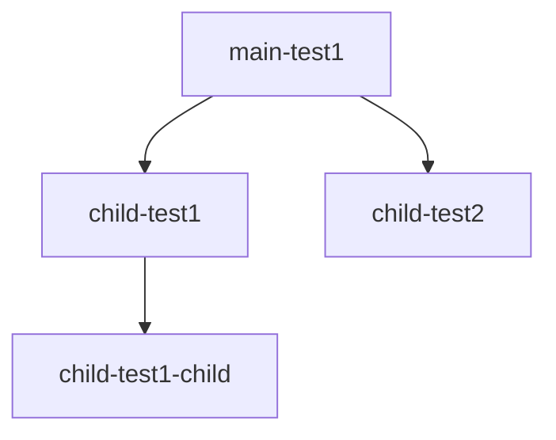

# Migrate Submodules

Git migrations tools like [GitHub Importer](https://docs.github.com/en/get-started/importing-your-projects-to-github/importing-source-code-to-github/importing-a-repository-with-github-importer) and even [ghe-migrator](https://docs.github.com/en/enterprise-server@3.3/admin/user-management/migrating-data-to-and-from-your-enterprise/migrating-data-to-your-enterprise) are not able to update [submodule urls](https://git-scm.com/docs/gitmodules#Documentation/gitmodules.txt-submoduleltnamegturl). This small script solves that problem by updating all your `.gitmodules` files recursively with a simple [sed](https://linux.die.net/man/1/sed) command.

[Install](https://github.com/austenstone/migrate-submodules#install-%EF%B8%8F)

You can run this script in any git repository and it will recursively itterate submodules and perform the following operations:
1. Executes the sed command provided via `-s` on .gitmodules
2. Synchronizes submodules' remote URL configuration setting to the value specified in .gitmodules
3. Updates(pulls) all submodules.
4. Commits the changes to the branch specified using the `-b` with the message provided via `-m`

#### NOTES
- You must have read/write permission on the repositories you are modifying
- This script will not import repositories for you and assumes all required repositories have already been imported to your target. This means if you are replacing the url of a submodule, the new URL must be pointing to a valid repository.

## Usage 🏃‍♂️
Clone your repo that contains submodules and cd inside:
```bash
git clone https://github.com/austenstone/main-test1.git
cd main-test1
```

Run the script. This example is migrating the url from `bitbucket.org` to `github.com`:
```bash
migrate-submodules.sh -s 's/bitbucket.org/github.com/g' -b 'master'
```
Congratulations. Your submodules have been updated! 🎉

Check them out 👀
```bash
cat .gitmodules && git submodule foreach --recursive '[ -f .gitmodules ] && cat .gitmodules || true'
```

If you are happy with the results, push your changes to remote:
```bash
git submodule foreach --recursive git push origin master
git push origin master
```

TIP: You can automatically sync all branches with master by running the following command:
```bash
for BRANCH in `ls .git/refs/heads`; do git rebase master $BRANCH; done
git push --all origin
```

## Install ⬇️
Simply add the script to your PATH.
```bash
cd /usr/local/bin
curl https://raw.githubusercontent.com/austenstone/migrate-submodules/main/migrate-submodules.sh > migrate-submodules.sh
chmod +x migrate-submodules.sh
```
Script tested on Ubuntu and MacOS.

## [main-test1](https://github.com/austenstone/main-test1) repo hierarchy
main-test1 is the root of a small set of repos and is used to test the functionality.


## Possible Improvements 🚧
- Use `set-url [--] <path> <newurl>` instead of sed.
- Sync all branches in the script
- Dynamically get the default branch using `git remote show origin | sed -n '/HEAD branch/s/.*: //p'`

## Inspiration ✨
- [Enteee/git-submodule-url-rewrite](https://github.com/Enteee/git-submodule-url-rewrite)
