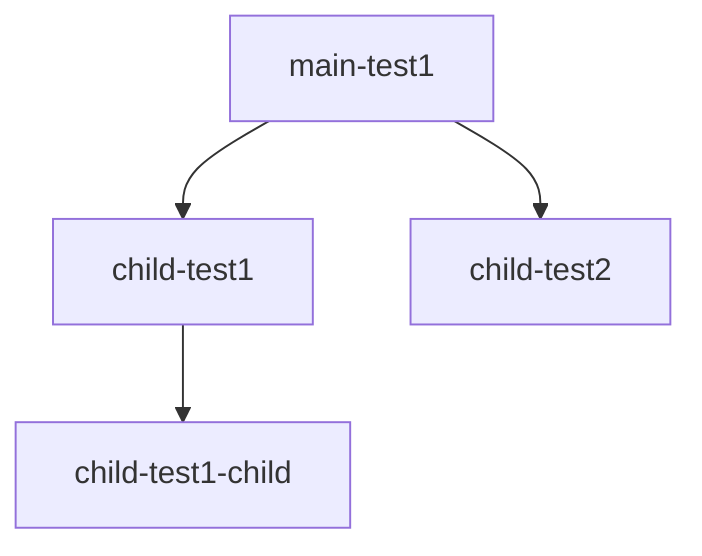

# Migrate Submodules

This is a small script to migrate submodules recursively using [sed](https://man7.org/linux/man-pages/man1/sed.1p.html).

You can run this script in any git repository and it will recursively itterate submodules do the following:
- Preform the sed command provided via `-s` on .gitmodules
- Synchronizes submodules' remote URL configuration setting to the value specified in .gitmodules
- Commits the changes to the branch specified using the message `-m`

You still need to push the changes it makes to remote.

## Usage
Clone your repo that contains submodules and cd inside:
```bash
git clone https://github.com/austenstone/main-test1.git
cd main-test1
```

Example repository being migrated from bitbucket to github:
```bash
migrate-submodules.sh -s 's/bitbucket.org/github.com/g' -b 'master'
```

To push your changes to remote:
```bash
git submodule foreach --recursive git push origin master
git push origin master
```

You can automatically sync all branches with master by running the following command:
```bash
for BRANCH in `ls .git/refs/heads`; do git rebase master $BRANCH; done
git push --all origin
```

## Install
```bash
cd /usr/local/bin
curl https://raw.githubusercontent.com/austenstone/migrate-submodules/main/migrate-submodules.sh > migrate-submodules.sh
chmod +x migrate-submodules.sh
```
## [main-test1](https://github.com/austenstone/main-test1) repo hierarchy
main-test1 is the root of a small set of repos and is used to test the functionality.

